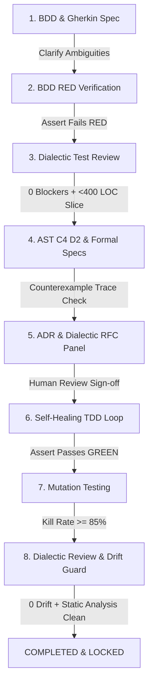

# Pi Craftsmanship Quality Gate Plugin (`pi-plugin-craftsmanship`)

A high-craftsmanship engineering extension for the **Pi Coding Agent** (`@earendil-works/pi-coding-agent`).

This plugin transforms Pi into a disciplined software craftsmanship engine that enforces **Hard Quality Gates**, **Dialectic Multi-Lens Reviews**, **Code-Generated C4 Architecture Diagrams**, **Alloy & TLA+ Formal Verification with Counterexample Traces**, **Architectural Drift Guards**, **Stateful Property Test Auto-Synthesis**, and **Self-Healing TDD RED/GREEN Iterations**.

---

## 🌟 Enhanced Workflow Architecture



---

## 🚀 Key Improvements & Design Features

### 1. 🛡️ Hard Quality Gate Enforcement
- **Hard Execution Block**: Pi event hooks (`before_tool_call`) intercept tool calls (`write_to_file`, `replace_file_content`, `multi_replace_file_content`) targeting implementation files (`src/`, `lib/`).
- **Strict Exception Throws**: If an agent attempts to write source code before completing prerequisite BDD, Test Review, C4/Formal Design, and RFC Human Sign-off, the hook **throws an execution block error**, preventing premature code writing.

### 2. 🗣️ Dialectic Multi-Lens Review Panels (No Arbitrary Scores)
- Replaces arbitrary numerical scores with structured **Dialectic Objections** categorized into severity levels:
  - 🛑 `BLOCKER`: Must be resolved before proceeding.
  - ⚠️ `MAJOR`: Requires explicit code/spec resolution or RFC trade-off note.
  - ℹ️ `MINOR`: Advisory recommendation.
- Evaluates test suites, RFC strategies (6 lenses: *Security, Consistency, Efficiency, Simplicity, Maintainability, Elegance*), and code implementation (7 lenses: *Security, Simplicity, Efficiency, Adherence, Test Quality, Elegance, Consistency*).
- **Mandatory Re-Review Loop**: Objections are fed back into agent context. The agent MUST resolve all `BLOCKER` and `MAJOR` objections, triggering a dialectic re-review until 0 blockers remain.

### 3. 🔍 Formal Methods with Counterexample Traces & Completeness Checks
- Executes TLC / Alloy model checker simulation logic.
- **State Counterexample Traces**: If an invariant or safety condition is violated, extracts the exact state counterexample trace (e.g. step-by-step variable transitions) and feeds it directly back to the agent context.
- **Completeness Evaluation**: Evaluates whether all domain state transitions and edge cases are modeled, blocking un-modeled transitions.

### 4. 📐 Architectural Drift Guard & Code-Generated C4 Diagrams
- **Code-Derived C4 Diagrams**: Parses source code AST structure, classes, and module imports to directly generate Context, Container, Component, and Code level D2 architecture diagrams (`specs/c4_architecture.d2`).
- **Architectural Drift Guard**: Inspects implementation code against C4 diagrams and ADR records. If un-documented external dependencies, ungoverned network clients, or un-recorded architectural changes are introduced, blocks final sign-off until ADRs and C4 diagrams are updated.

### 5. ⚡ Stateful Property-Based Test Auto-Synthesis (Idea #5)
- Auto-generates stateful property-based test suites (`fast-check` / `hypothesis`) derived directly from TLA+ initial states (`Init`), state transitions (`Next`), and invariants.
- Executes randomized state transition sequences with shrinking to catch edge-case state violations in code.

### 6. 🔁 Self-Healing TDD RED/GREEN Iteration Engine (Idea #6)
- **Automated TDD Iteration Loop** (`craft_auto_tdd_loop`): Executes unit tests, captures stack traces and assertion diffs, asserts RED failure state before code exists, then verifies clean GREEN passing state.

---

## ⚡ Slash Commands

| Slash Command | Description |
|---|---|
| `/craft-init` | Initialize directory structure (`features/`, `specs/`, `docs/adr/`, `docs/rfc/`, `.craftsmanship/`) |
| `/craft-status` | Display interactive dashboard of current phase, hard gate status, and dialectic objections |
| `/craft-bdd [name]` | Interactively generate BDD Gherkin specs & ask clarifying questions |
| `/craft-review-tests` | Run dialectic pre-implementation test review & slice size check (<400 LOC) |
| `/craft-design` | Render AST C4 diagrams in D2, Alloy/TLA+ formal models, and stateful property tests |
| `/craft-rfc [title]` | Trigger dialectic 6-lens RFC panel or record human approval (`/craft-rfc approve <id>`) |
| `/craft-tdd` | Run self-healing TDD RED/GREEN loop & mutation test kill rate validation (>=85%) |
| `/craft-review` | Run static analysis, Architectural Drift Guard, & 7-lens dialectic code review |

---

## 🧪 Running Tests

```bash
npm run build
npm test
```

All 7 core workflow unit and integration test suites run via Vitest.
