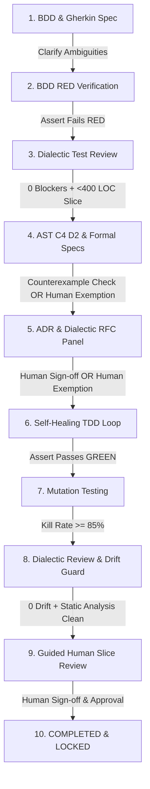

# Pi Craftsmanship Quality Gate Plugin (`pi-plugin-craftsmanship`)

A high-craftsmanship engineering extension for the **Pi Coding Agent** (`@earendil-works/pi-coding-agent`).

This plugin transforms Pi into a disciplined software craftsmanship engine that enforces **Hard Quality Gates**, **Human-Approved Low-Risk Exemptions**, **Dialectic Multi-Lens Reviews**, **Code-Generated C4 Architecture Diagrams**, **Alloy & TLA+ Formal Verification with Counterexample Traces**, **Architectural Drift Guards**, **Stateful Property Test Auto-Synthesis**, **Self-Healing TDD RED/GREEN Iterations**, and **Guided Human Slice Review Walkthroughs**.

---

## 🌟 Complete Workflow Architecture



---

## 🚀 Core Features & Quality Control Mechanisms

### 1. 🛡️ Human-Approved Low-Risk Exemption Engine
- **Strict Hard Gate Enforcement**: For smaller or lower-risk work (e.g. minor bug fixes or small utility tweaks), steps like formal methods (Alloy/TLA+), C4 diagrams, ADRs, or RFCs may be skipped **ONLY IF** explicit human approval is requested and granted.
- **Agent Exemption Request Tool** (`craft_request_gate_exemption`): The agent evaluates risk, provides an explicit risk assessment explanation, and prompts the human for approval.
- **Slash Command** (`/craft-skip <gate>`): Allows developers or agents to request human confirmation to skip heavy steps (`FORMAL_METHODS`, `C4_DIAGRAMS`, `ADR_DOCUMENTATION`, `RFC_GOVERNANCE`).
- **Zero Un-Authorized Bypass**: Without `humanApproved: true`, the hard quality gate **strictly blocks** any attempt to bypass heavy design steps.

### 2. 👥 Guided Human Slice Review Walkthrough
- **Mandatory Human Sign-off at End of Slice**: At the end of every feature slice (<400 LOC), before a slice can be locked/completed, the plugin launches a **6-checkpoint Guided Human Slice Review Walkthrough** (`/craft-slice-review` / `craft_guided_human_slice_review`).
- **Review Walkthrough Checkpoints**:
  1. 🎯 **Slice Scope & BDD Acceptance Criteria**: User Story, Given-When-Then scenarios, RED verification.
  2. 📐 **C4 Architecture & ADR Decisions**: Code-derived D2 diagrams and MADR records (or approved exemptions).
  3. 🔬 **Formal Verification & Property Tests**: Alloy models, TLA+ invariants, and stateful `fast-check` tests (or approved exemptions).
  4. 🛡️ **RFC Panel Outcomes**: Dialectic 6-lens critiques and RFC trade-off sign-offs (or approved exemptions).
  5. 🧪 **Test Suite & Mutation Metrics**: RED/GREEN verification and >= 85% mutant kill rate.
  6. 🔍 **Static Analysis, Drift Guard & 7-Lens Code Review**: 0 compiler errors, 0 architectural drift, and 0 dialectic blockers.
- Requires explicit human approval notes to lock the slice as `COMPLETED_LOCKED`.

### 3. 🛡️ Hard Quality Gate Enforcement
- **Hard Execution Block**: Pi event hooks (`before_tool_call`) intercept tool calls (`write_to_file`, `replace_file_content`, `multi_replace_file_content`) targeting implementation files (`src/`, `lib/`).
- **Strict Exception Throws**: If an agent attempts to write source code before completing prerequisite BDD, Test Review, C4/Formal Design, RFC Approval, or Guided Human Review, the hook **throws an execution block error**.

### 4. 🗣️ Dialectic Multi-Lens Review Panels (No Arbitrary Scores)
- Structured **Dialectic Objections** categorized into severity levels:
  - 🛑 `BLOCKER`: Must be resolved before proceeding.
  - ⚠️ `MAJOR`: Requires explicit code/spec resolution or RFC trade-off note.
  - ℹ️ `MINOR`: Advisory recommendation.
- Evaluates test suites, RFC strategies (6 lenses: *Security, Consistency, Efficiency, Simplicity, Maintainability, Elegance*), and code implementation (7 lenses: *Security, Simplicity, Efficiency, Adherence, Test Quality, Elegance, Consistency*).
- **Mandatory Re-Review Loop**: Objections are fed back into agent context. The agent MUST resolve all `BLOCKER` and `MAJOR` objections, triggering a dialectic re-review until 0 blockers remain.

### 5. 🔍 Formal Methods with Counterexample Traces & Completeness Checks
- **State Counterexample Traces**: If an invariant or safety condition is violated, extracts the exact state counterexample trace and feeds it directly back to the agent context.
- **Completeness Evaluation**: Evaluates whether all domain state transitions and edge cases are modeled in the formal spec.

### 6. 📐 Architectural Drift Guard & Code-Generated C4 Diagrams
- **Code-Derived C4 Diagrams**: Parses source code AST structure, classes, and module imports to directly generate Context, Container, Component, and Code level D2 architecture diagrams (`specs/c4_architecture.d2`).
- **Architectural Drift Guard**: Inspects implementation code against C4 diagrams and ADR records. If un-documented external dependencies or un-recorded architectural changes are introduced, blocks final sign-off until ADRs and C4 diagrams are updated.

### 7. ⚡ Stateful Property-Based Test Auto-Synthesis
- Auto-generates stateful property-based test suites (`fast-check` / `hypothesis`) derived directly from TLA+ initial states (`Init`), state transitions (`Next`), and invariants.

### 8. 🔁 Self-Healing TDD RED/GREEN Iteration Engine
- **Automated TDD Iteration Loop** (`craft_auto_tdd_loop`): Executes unit tests, captures stack traces and assertion diffs, asserts RED failure state before code exists, then verifies clean GREEN passing state.

---

## ⚡ Slash Commands

| Slash Command | Description |
|---|---|
| `/craft-init` | Initialize directory structure (`features/`, `specs/`, `docs/adr/`, `docs/rfc/`, `.craftsmanship/`) |
| `/craft-status` | Display interactive dashboard of current phase, hard gate status, exemptions, and dialectic objections |
| `/craft-skip [gate]` | Request human approval to skip heavy steps for low-risk work (`FORMAL_METHODS`, `C4_DIAGRAMS`, `ADR_DOCUMENTATION`, `RFC_GOVERNANCE`) |
| `/craft-bdd [name]` | Interactively generate BDD Gherkin specs & ask clarifying questions |
| `/craft-review-tests` | Run dialectic pre-implementation test review & slice size check (<400 LOC) |
| `/craft-design` | Render AST C4 diagrams in D2, Alloy/TLA+ formal models, and stateful property tests |
| `/craft-rfc [title]` | Trigger dialectic 6-lens RFC panel or record human approval (`/craft-rfc approve <id>`) |
| `/craft-tdd` | Run self-healing TDD RED/GREEN loop & mutation test kill rate validation (>=85%) |
| `/craft-review` | Run static analysis, Architectural Drift Guard, & 7-lens dialectic code review |
| `/craft-slice-review` | Conduct Guided Human Slice Review walkthrough & record human approval sign-off |

---

## 🧪 Running Tests

```bash
npm run build
npm test
```

All 8 core workflow unit and integration test suites run via Vitest.
