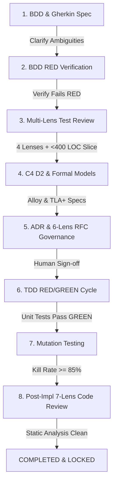

# Pi Craftsmanship Quality Gate Plugin (`pi-plugin-craftsmanship`)

A comprehensive quality-enforcement extension for the **Pi Coding Agent** (`@earendil-works/pi-coding-agent`). 

This plugin transforms Pi into a rigorous software craftsmanship engine that enforces BDD specification, TDD RED/GREEN workflows, C4 architecture diagrams, Alloy & TLA+ formal verification, ADR documentation, multi-lens RFC panels with human sign-off, mutation testing, and 7-lens static analysis code review.

---

## 🌟 Workflow Quality Phases



---

## 🛠 Features & Capabilities

### 1. BDD Acceptance Criteria & Gherkin Engine
- Starts projects with explicit BDD acceptance criteria using standard **Gherkin syntax** (`Feature`, `Scenario`, `Given`, `When`, `Then`).
- Scans acceptance criteria for ambiguous language (e.g., *"fast"*, *"user-friendly"*, *"appropriate"*) and generates targeted clarifying questions for developers.
- Verifies that BDD tests are executed and fail **RED** (for missing feature logic) before implementation begins.

### 2. Multi-Lens Pre-Implementation Test Review Panel
Critiques test suites across 4 distinct quality lenses:
- **Acceptance Criteria Coverage**: Maps every scenario to user story requirements.
- **Edge Case Coverage**: Evaluates boundary values, null payloads, error paths, and invalid inputs.
- **Flakiness Risk**: Identifies async timing hazards, sleep calls, non-determinism, and shared global state leakage.
- **Fixtures & Closures**: Ensures setup/teardown encapsulation and mock isolation.
- **Slice Decomposition Check**: Enforces that problem slices are decomposed into small units (**< 400 lines of code** per slice).

### 3. System Design & Formal Methods
- **C4 Architecture Diagrams**: Renders Context, Container, Component, and Code level diagrams formatted in **D2 syntax** (`specs/c4_architecture.d2`).
- **Formal Verification Models**:
  - **Alloy (`.als`)**: Declarative relational logic specifications (`sig`, `facts`, `predicates`, `asserts`, `check`) to mathematically prove out domain abstractions.
  - **TLA+ (`.tla` / `.cfg`)**: Concurrent state machine specifications (`MODULE`, `VARIABLES`, `Init`, `Next`, `Spec`, invariants) to verify state safety and temporal logic.
- **Property-Based Testing**: Integrates property test specifications (`fast-check` / `hypothesis`).

### 4. Architecture Governance (ADRs & RFCs)
- **ADR Generator**: Standardized MADR format records (`docs/adr/0001-title.md`).
- **RFC Engine & 6-Lens Agent Panel**:
  For challenging architectural decisions without a clear answer, evaluates strategy across 6 agent lenses:
  1. 🛡️ **Security**: Vulnerabilities, threat vectors, data boundaries, authz.
  2. 📐 **Consistency**: Pattern alignment with existing codebase and C4 hierarchy.
  3. ⚡ **Efficiency**: CPU/memory complexity, IO overhead, query batching.
  4. 🧘 **Simplicity**: YAGNI, minimal abstraction depth, straightforward control flow.
  5. 🔧 **Maintainability**: Low coupling, high cohesion, debuggability.
  6. ✨ **Elegance**: Clean API ergonomics and intuitive interfaces.
- **Human Review Solicitation**: Suspends automatic execution and requires explicit human sign-off (`/craft-rfc approve <id>`) before implementation can begin.

### 5. TDD RED/GREEN Implementation Phase
- Software written ONLY after preceding BDD, Test Review, C4/Formal Design, and RFC phases are approved.
- Strict unit test RED/GREEN loop: tests written first and verified failing RED, then implementation written to turn GREEN.
- **Mutation Testing Integration**: Evaluates mutant creation & killing metrics (Stryker / Mutmut integration + synthetic AST mutant generator) to enforce **>= 85% mutant kill rate**.

### 6. Post-Implementation Multi-Lens Code Review
- Collects static analysis diagnostics (ESLint, TypeScript `tsc`, PyLint, Clippy) to inform review.
- Evaluates completed code across 7 lenses:
  1. **Security**
  2. **Simplicity**
  3. **Efficiency**
  4. **Adherence to design / formal models / C4 diagrams**
  5. **Test quality**
  6. **Elegance / separation of concerns**
  7. **Consistency**

---

## ⚡ Slash Commands

| Slash Command | Description |
|---|---|
| `/craft-init` | Initialize directory structure (`features/`, `specs/`, `docs/adr/`, `docs/rfc/`, `.craftsmanship/`) |
| `/craft-status` | Display interactive dashboard of current phase, slice metrics, and gate status |
| `/craft-bdd [name]` | Interactively generate BDD Gherkin specs & ask clarifying questions |
| `/craft-review-tests` | Run 4-lens pre-implementation test review & slice size check (<400 LOC) |
| `/craft-design` | Render C4 diagrams in D2 and generate Alloy & TLA+ formal specifications |
| `/craft-rfc [title]` | Trigger 6-lens RFC agent panel or record human approval (`/craft-rfc approve <id>`) |
| `/craft-tdd` | Verify TDD RED/GREEN execution cycle & mutation test kill rate (>=85%) |
| `/craft-review` | Run static analysis & 7-lens post-implementation code review |

---

## 🧰 Registered Pi Tools

- `craft_analyze_requirements`: Analyzes acceptance criteria ambiguity and generates Gherkin.
- `craft_review_tests`: Evaluates test suite across 4 lenses and checks <400 LOC slice limit.
- `craft_generate_c4_d2`: Builds Context, Container, Component, and Code C4 D2 diagrams.
- `craft_generate_formal_spec`: Generates Alloy (`.als`), TLA+ (`.tla`/`.cfg`), and Property test specs.
- `craft_create_adr`: Records MADR architecture decision record in `docs/adr/`.
- `craft_run_rfc_panel`: Evaluates strategy across 6 agent lenses and solicits human sign-off.
- `craft_verify_tdd_red`: Asserts unit tests fail RED prior to implementation.
- `craft_run_mutation_tests`: Executes mutation testing suite and verifies >= 85% kill rate threshold.
- `craft_run_code_review`: Runs static analysis & 7-lens post-implementation review.
- `craft_check_gate`: Checks workflow quality gate state and transition rules.

---

## 🛡️ Event Lifecycle Hooks

The plugin automatically registers `before_tool_call` hooks in Pi to intercept file write/edit tools (`write_to_file`, `replace_file_content`). If an LLM or developer attempts to write implementation code in `src/` or `lib/` before completing BDD, Test Review, C4/Formal Design, and RFC Human Approval, the hook notifies with a Quality Gate warning to maintain strict engineering discipline!

---

## 📦 Installation & Setup

Add to your Pi settings (`~/.pi/agent/settings.json`):

```json
{
  "extensions": [
    "/home/cbsmith/projects/coder/dist/index.js"
  ]
}
```

Or install in a local project:

```bash
cd /path/to/your/project
pi install /home/cbsmith/projects/coder
```

---

## 🧪 Running Tests

```bash
npm run build
npm test
```

All 6 core workflow test suites run via Vitest.
